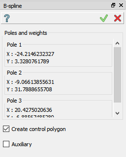
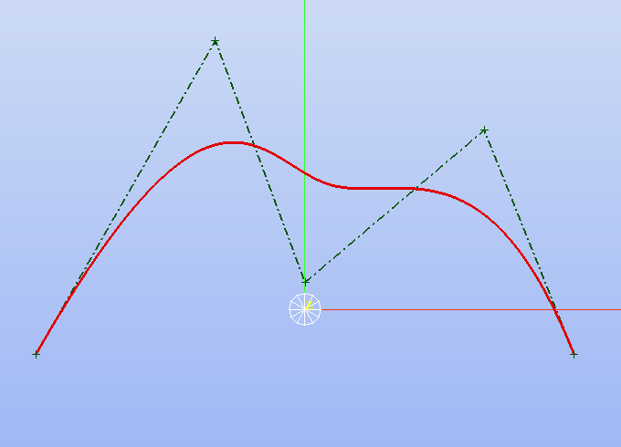
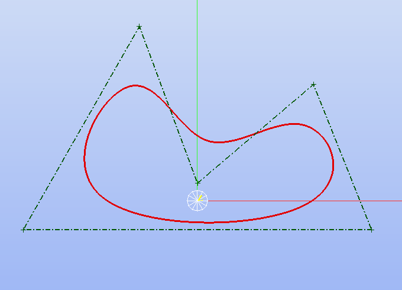
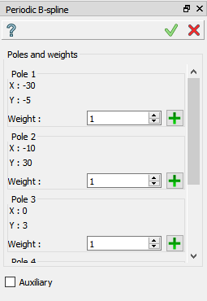

.. |bspline.icon|    image:: images/bspline.png
.. |bspline_p.icon|  image:: images/bspline_p.png
.. |add_pole.icon|   image:: images/bspline_add_pole.png

B-spline and periodic B-spline
==============================

The feature creates a free form spline curve in the current Sketch.

To add a new B-spline to the Sketch:

#. select in the Main Menu *Sketch - > B-spline* item  or
#. click |bspline.icon| **B-spline** button in the Sketch toolbar.

To add a periodic B-spline to the Sketch:

#. select in the Main Menu *Sketch - > Periodic B-spline* item  or
#. click |bspline_p.icon| **Periodic B-spline** button in the Sketch toolbar.

Creation of B-spline curve
""""""""""""""""""""""""""

Click in the view to specify the control polygon of B-spline curve. The curve will be shown after the second point is initialized. To stop adding new poles, click **Esc** button or **Apply** the operation.

**TUI Command**:

.. py:function:: Sketch_1.addSpline(degree, poles, weights, knots, multiplicities, periodic)

    :param integer: degree of B-spline.
    :param array: list of poles [(x1, y1), (x2, y2), ...].
    :param array: list of weights for corresponding poles.
    :param array: parametric knots of B-spline curve.
    :param array: multiplicity of each knot.
    :param boolean: True mentions that the B-spline curve is periodic.
    :return: Result object.

Each parameter is optional.

Result
""""""

Created B-spline curve appears in the view.

   Non-periodic B-spline created

   Periodic B-spline created

**See Also** a sample TUI Script of :ref:`tui_create_bspline` operation.

Modification of B-spline curve
""""""""""""""""""""""""""""""

   Modification panel for B-spline curve

The following options are provided to modify the already created B-spline curve:

#. Change weight of each pole.
#. Add new pole.

The new pole is added after the current by pressing on the corresponding |add_pole.icon| button. The default weight for the new pole is 1. 

**Note:** adding the new pole after the last for non-periodic B-spline will not change the last point of the curve to avoid modification of full sketch.
