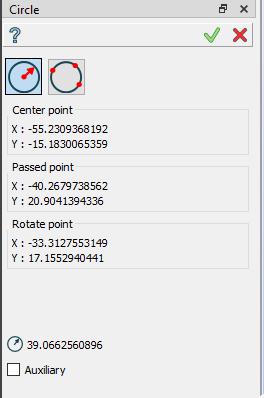
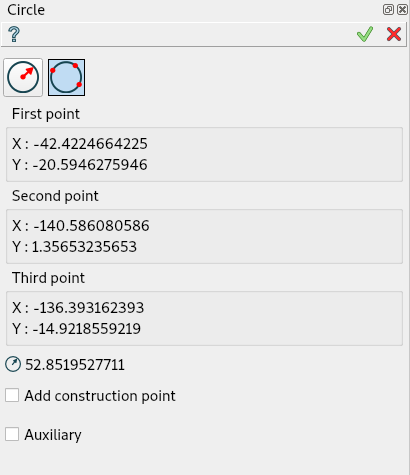
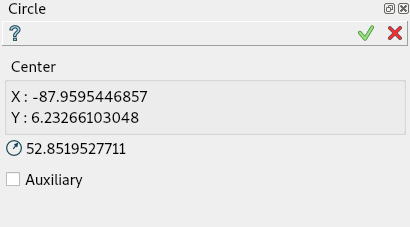
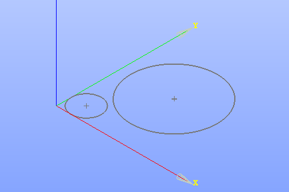

Circle
======

The feature Circle creates a circle in the current Sketch.

To add a new Circle to the Sketch:

#. select in the Main Menu *Sketch - > Circle* item  or
#. click **Circle** button in Sketch toolbar:

.. image:: images/circle.png
   :align: center

.. centered::
   **Circle**  button

There are 2 algorithms for creation of a Circle:

.. image:: images/circle_pt_rad_32x32.png
   :align: left
**By center and passed point** creates a circle with the given center passing through the given point.

.. image:: images/circle_3pt_32x32.png
   :align: left
**By three points** creates a circle passing through the given three points.

By center and passed point
""""""""""""""""""""""""""

Click in the view once to set the center point, then move the mouse and click a second time to set the passed point.

- When entering a center point by selecting either a point or a segment, a Coincident constraint is created.
- When entering a passing point by selecting a point, a Coincident constraint is also created.
- When entering a passing point by selecting a segment, a Tangent constraint is created.

**TUI Command**:  *Sketch_1.addCircle(CenterX, CenterY, PassedX, PassedY)*

**Arguments**:    4 values (coordinates of the center and the passed point).

By three points
"""""""""""""""

Click in the view once to set the first passed point, then move the mouse and click a second time to set the second passed point
and finally move the mouse and click a third time to set the last passed point.

- When entering a passing point by selecting a point, a Coincident constraint is created.
- When entering a passing point by selecting a segment, a Tangent constraint is created.

**TUI Command**:  *Sketch_1.addCircle(X1, Y1, X2, Y2, X3, Y3)*

**Arguments**:    6 values (coordinates of three points).

Property panel in edition context
"""""""""""""""""""""""""""""""""

The following property panel appears when the user selects an existing circle.

Note that the edition property panel does not show the used creation algorithm.

The panel shows:

- center coordinates and radius (read-only).
- auxiliary flag (can be modified).

Result
""""""

Created circle appears in the view.

.. centered::
   Circle created

**See Also** a sample TUI Script of :ref:`tui_create_circle` operation.
