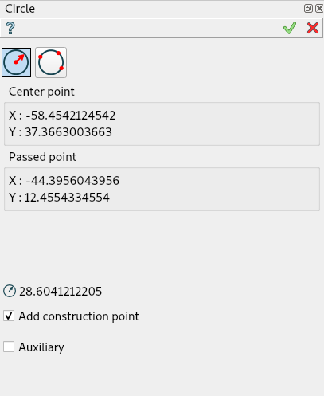

.. |circle.icon|    image:: images/circle.png

Circle
======

The feature Circle creates a circle and point on line in the current Sketch.

To add a new Circle to the Sketch:

#. select in the Main Menu *Sketch - > Circle* item  or
#. click |circle.icon| **Circle** button in Sketch toolbar:

There are 2 algorithms for creation of a Circle:

.. figure:: images/circle_pt_rad_32x32.png
   :align: left
   :height: 24px

**By center and passed point** creates a circle with the given center passing through the given point.

.. figure:: images/circle_3pt_32x32.png
   :align: left
   :height: 24px

**By three points** creates a circle passing through the given three points.

-------------------------------------------------------------------------------------------

By center and passed point
""""""""""""""""""""""""""

Click in the view once to set the center point, then move the mouse and click a second time to set the passed point and finally 
click third time to set point on the line.

- When entering a center point by selecting either a point or a segment, a Coincident constraint is created.
- When entering a passing point by selecting a point, a Coincident constraint is also created.
- When entering a passing point by selecting a segment, a Tangent constraint is created.

- Point on the line show sewing point for circle. If rotate this point, sewing point also will be changed 

**TUI Command**:

.. py:function:: Sketch_1.addCircleWithPoint(CenterX, CenterY, PassedX, PassedY, Angle)

    :param real: Start X.
    :param real: Start Y.
    :param real: Passed X.
    :param real: Passed Y.
    :param real: Rotation angle for sewing point
    :return: Result object.

.. py:function:: SketchCircle_1.createdPoint()
   :return: Created point on circle line

This method is deprecated, please, use addCircleWithPoint

.. py:function:: Sketch_1.addCircle(CenterX, CenterY, PassedX, PassedY)

    :param real: Start X.
    :param real: Start Y.
    :param real: Passed X.
    :param real: Passed Y.
    :return: Result object.

By three points
"""""""""""""""

Click in the view once to set the first passed point, then move the mouse and click a second time to set the second passed point
then move the mouse and click a third time to set the last passed point, and finally 
click last time to set point on the line.

- When entering a passing point by selecting a point, a Coincident constraint is created.
- When entering a passing point by selecting a segment, a Tangent constraint is created.

- Point on the line show sewing point for circle. If rotate this point, sewing point also will be changed 
**TUI Command**:

.. py:function:: Sketch_1.addCircleWithPoint(X1, Y1, X2, Y2, X3, Y3, Angle)

    :param real: Start X.
    :param real: Start Y.
    :param real: Passed X.
    :param real: Passed Y.
    :param real: End X.
    :param real: End Y.
    :param real: Rotation angle for sewing point
    :return: Result object.

.. py:function:: SketchCircle_1.createdPoint()
   :return: Created point on circle line

This method is deprecated, please, use addCircleWithPoint

.. py:function:: Sketch_1.addCircle(X1, Y1, X2, Y2, X3, Y3)

    :param real: Start X.
    :param real: Start Y.
    :param real: Passed X.
    :param real: Passed Y.
    :param real: End X.
    :param real: End Y.
    :return: Result object.

Property panel in edition context
"""""""""""""""""""""""""""""""""

The following property panel appears when the user selects an existing circle.

Note that the edition property panel does not show the used creation algorithm.

The panel shows:

- center coordinates and radius (read-only).
- auxiliary flag (can be modified).

Result
""""""

Created circle appears in the view.

.. figure:: images/Circle_res.png
   :align: center

   Circle created

**See Also** a sample TUI Script of :ref:`tui_create_circle` operation.
