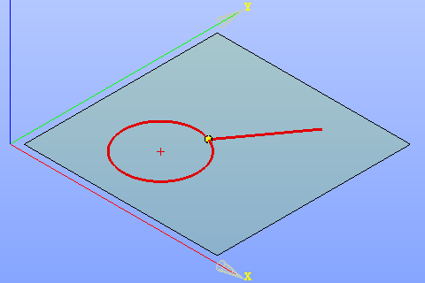

.. _sketchCoincident:

Coincident constraint
=====================

Coincident constraint forces two points to be coincident, or one point to lie on a line, a circle or an arc.

To create a Coincident constraint in the active Sketch:

#. select in the Main Menu *Sketch - > Coincident* item  or
#. click **Coincident** button in Sketch toolbar:

.. centered::
   **Coincident**  button

Property panel:

.. image:: images/Coincident_panel.png
   :align: center

Input fields:

- **First object** is a point, a line, a circle or an arc selected in the view.
- **Second object** is a point, a line, a circle or an arc selected in the view.

Note that one of two objects should be a point (i.e. a point, a line or an arc end point, a center of a circle or an arc).

After the objects are selected, the point is highlighted in yellow in the view.

**TUI Command**: *Sketch_1.setCoincident(Object1, Object2)*

**Arguments**:  2 objects (one of them is a point, the second one is a point, a circle, an arc or a line)

Result
""""""

Created Coincident constraint appears in the view.

.. centered::
   Created coincident constraint

**See Also** a sample TUI Script of :ref:`tui_create_coincident` operation.