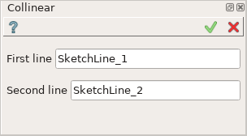
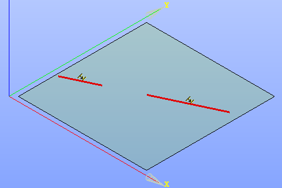

.. |collinear.icon|    image:: images/collinear.png

Collinear constraint
====================

Collinear constraint forces lines to be collinear.

To create a Collinear constraint in the active Sketch:

#. select in the Main Menu *Sketch - > Collinear* item  or
#. click |collinear.icon| **Collinear** button in Sketch toolbar:

Property panel:

Input fields:

- **First line** is the first line selected in the view.
- **Second line** is the second line selected in the view.

| After the lines are selected, they are translated to become collinear.
| The lines are marked with a special sign.

**TUI Command**:

.. py:function:: Sketch_1.setCollinear(Line1, Line2)

    :param object: First object.
    :param object: Second object.
    :return: Result object.

Result
""""""

Created Collinear constraint appears in the view.

   Created collinear constraint

**See Also** a sample TUI Script of :ref:`tui_create_collinear` operation.
