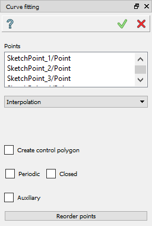
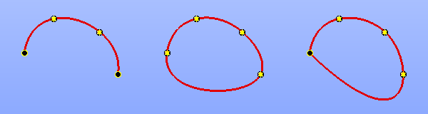
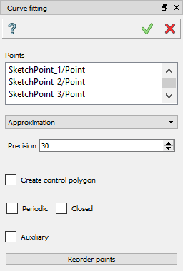
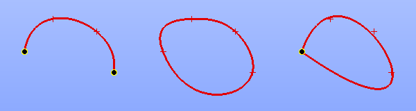

Curve Fitting
=============

The Curve Fitting is a tool to create a curve by a set of given points.

To start this operation:

#. select *Sketch - > Curve fitting* item in the Main Menu or
#. click |curvefitting.icon| **Curve fitting** button in the Sketch toolbar:

There are 2 algorithms for the curve creation:

- **Interpolation** - the curve passes exactly through the selected points;
- **Approximation** - curve passes near the selected points to some extent.

Both algorithms have additional options:

- **Periodic** - forces the created curve to be smooth periodic curve;
- **Closed** - produces closed, but non-periodic curve. As a result, it has the same start and end points, but it may be connected non-smoothly there;
- **Create control polygon** - if the fitting curve is a B-spline curve, this option will create it's control polygon.

Interpolation
"""""""""""""

Select the list of points to create a curve. The curve will pass directly through these points in the given order.

Clicking the **Reorder points** button will change the order of selected points to minimize the distances between the neighbors.

**TUI Command**:

.. py:function:: Sketch_1.addInterpolation(points, periodic = False, closed = False)

    :param list: points for the curve.
    :param boolean: flag to make the curve periodic.
    :param boolean: flag to make the curve closed but not periodic.
    :return: Created B-spline curve.

Result
""""""

The created B-spline curve appears in the view.

.. centered::
   Interpolation curve (non-closed, periodic and closed)

**See Also** a sample TUI Script of :ref:`tui_create_interpolation` operation.

Approximation
"""""""""""""

Select the list of points to create a curve and set the **Precision** value. The curve will pass not far than the precision of these points.

Clicking the **Reorder points** button will change the order of selected points to minimize the distances between the neighbors.

**TUI Command**:

.. py:function:: Sketch_1.addApproximation(points, precision = 0.001, periodic = False, closed = False)

    :param list: points for the curve.
    :param double: how close the curve should pass according to the points.
    :param boolean: flag to make the curve periodic.
    :param boolean: flag to make the curve closed but not periodic.
    :return: Created B-spline curve.

Result
""""""

The created B-spline curve appears in the view.

.. centered::
   Approximated curve (non-closed, periodic and closed)

**See Also** a sample TUI Script of :ref:`tui_create_approximation` operation.
