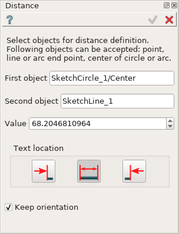
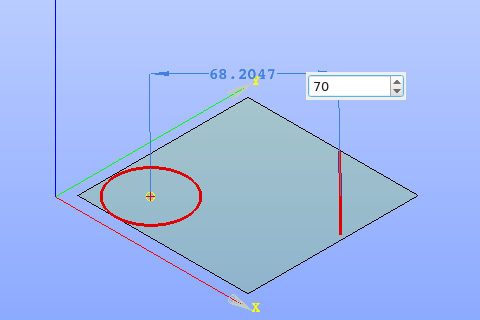
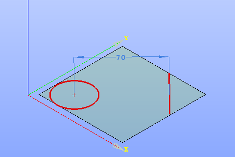

Distance constraint
===================

Distance constraint fixes the distance between two objects.

The constraint can be defined between such objects as point, line, line or arc end point, center of circle or arc.

To create a Distance constraint in the active Sketch:

#. select in the Main Menu *Sketch - > Distance* item  or
#. click **Distance** button in Sketch toolbar:

.. image:: images/distance.png
   :align: center

.. centered::
   **Distance**  button

Property panel:

Input fields:

- **First object** is the first object selected in the view;
- **Second object** is the second object selected in the view;
- **Value** is a distance between the objects, can be modified to set the desirable value;
- **Text location** is a position of the distance value label relating to extension line (in the view):
   .. image:: images/location_left.png
      :align: left
   **Left** inserts text to the left of the distance extension line;

   .. image:: images/location_automatic.png
      :align: left
   **Automatic** inserts text in the middle of the distance extension line if it has enough length, otherwise - to the left;

   .. image:: images/location_right.png
      :align: left
   **Right** inserts text to the right of the distance extension line;
- **Keep orientation** fixes the relative position between selected objects.

When both objects are selected, the distance value is displayed in the property panel and in the view.

When creating a constraint after selection of two objects for the first time:

- drag the distance presentation in the view to the desired position and click once;
- set the desirable distance value in the input field and press **Enter** or just press **Enter** to keep the current distance.

.. centered::
   Distance input in the view

**TUI Command**: *Sketch_1.setDistance(FirstObject, SecondObject, Value, KeepOrientation)*

**Arguments**:  2 objects + distance value + keep orientation flag

Result
""""""

Created Distance appears in the view.

.. centered::
   Distance created

**See Also** a sample TUI Script of :ref:`tui_create_distance` operation.
