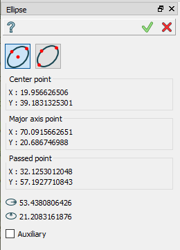
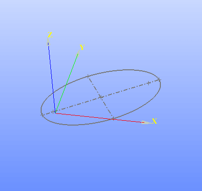

Ellipse
=======

The feature Ellipse creates an ellipse in the current Sketch.

To add a new Ellipse to the Sketch:

#. select in the Main Menu *Sketch - > Ellipse* item  or
#. click |ellipse.icon| **Ellipse** button in Sketch toolbar:

There are 2 algorithms for creation of an Ellipse:

.. image:: images/ellipse_cent_rad_32x32.png
   :align: left
**By center and major semi-axes and passing points** creates an ellipse with the given center passing through given points.

**By major axis and passing point** creates an ellipse passing through the given three points.

By center and major semi-axes and passing points
""""""""""""""""""""""""""""""""""""""""""""""""

Click in the view once to set the center point, then move the mouse and click to set a point of a first semi-axis, then again move the mouse to set a point of a second semi-axis.

**TUI Command**:

.. py:function:: Sketch_1.addEllipse(CenterX, CenterY, MajorAxisX, MajorAxisY, PassedX, PassedY, True)

    :param real: Center X.
    :param real: Center Y.
    :param real: Major Axis X.
    :param real: Major Axis Y.
    :param real: Passed X.
    :param real: Passed Y.
    :param boolean: True mentions that the first coordinates define the center of the ellipse.
    :return: Result object.

By major axis and passing point
"""""""""""""""""""""""""""""""

.. image:: images/ellipse_panel_3pt.png
   :align: center

Click in the view once to set a first point of a first axis, then move the mouse and click to set a second point of the first axis, then again move the mouse to set a point of a second semi-axis.

**TUI Command**:

.. py:function:: Sketch_1.addEllipse(MajorAxisStartX, MajorAxisStartY, MajorAxisEndX, MajorAxisEndY, PassedX, PassedY, False)

    :param real: Major Axis Start X.
    :param real: Major Axis Start Y.
    :param real: Major Axis End X.
    :param real: Major Axis End Y.
    :param real: Passed X.
    :param real: Passed Y.
    :param boolean: False mentions that the first coordinates define the start point of major axis of the ellipse.
    :return: Result object.

Result
""""""

Created ellipse appears in the view.

.. centered::
   Ellipse created

**See Also** a sample TUI Script of :ref:`tui_create_ellipse` operation.
