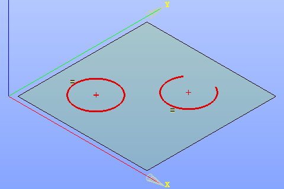

.. _sketchEqual:
.. |equal.icon|    image:: images/equal.png

Equal constraint
================

| Equal constraint makes lines, circles or arcs equal.
| Lines become equal in length, circles and arcs - equal in radius.

To create an Equal constraint in the active Sketch:

#. select in the Main Menu *Sketch - > Equal* item  or
#. click |equal.icon| **Equal** button in Sketch toolbar:

Property panel:

.. image:: images/Equal_panel.png
   :align: center

Input fields:

- **First object** is a line, a circle or an arc selected in the view.
- **Second object** is a line, a circle or an arc selected in the view.

Note that a line can be equal to a line only, a circle - to a circle or an arc.

| After the objects are selected, the object sizes become equal.
| The equal objects are marked with **=** sign.

**TUI Command**:

.. py:function:: Sketch_1.setEqual(Object1, Object2)

    :param object: First object.
    :param object: Second object.
    :return: Result object.

Result
""""""

Created Equal constraint appears in the view.

.. centered::
   Created equal constraint

**See Also** a sample TUI Script of :ref:`tui_create_equal` operation.