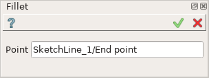
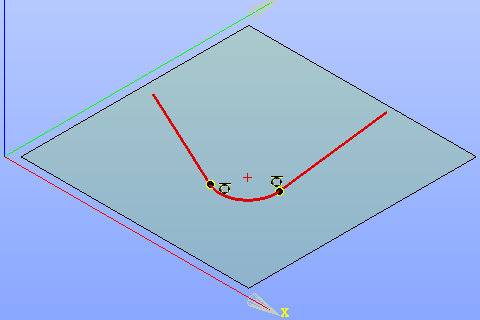

Fillet
======

| The Fillet operation rounds the corner formed by intersection of two sketch elements in a coincident point.
| The operation trims the elements at the intersection and creates a tangent arc between them.

To create Fillet in the active Sketch:

#. select in the Main Menu *Sketch - > Fillet* item  or
#. click **Fillet** button in Sketch toolbar:

.. image:: images/fillet.png
   :align: center

.. centered::
   **Fillet**  button

Property panel:

.. centered::
   Fillet

Input fields:

- **Point** is the coincident point of two intersecting lines (or a line and an arc) selected in the view.

After the point is selected Fillet preview appears in the view.

**TUI Command**:

- *Sketch_1.setFillet(Point)*

  **Arguments**: coincident point

- *Sketch_1.setFilletWithRadius(Point, Radius)*

  **Arguments**: coincident point and fillet radius

Result
""""""

Created Fillet appears in the view.

.. centered::
   Fillet created

**See Also** a sample TUI Script of a :ref:`tui_create_fillet` operation.