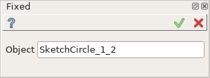
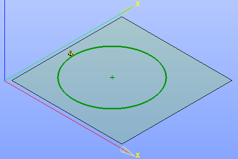

Fixed constraint
================

Fixed constraint fixes objects position and size.

The constraint can be defined for such objects as point, line, line or arc end point, center of circle or arc, whole circle or arc.

To create Fixed constraint in the active Sketch:

#. select in the Main Menu *Sketch - > Fixed* item  or
#. click **Fixed** button in Sketch toolbar:

.. image:: images/fixed.png
   :align: center

.. centered::
   **Fixed**  button

Property panel:

Input fields:

- **Object** is the object selected in the view.

After the object is selected anchor sign will be added close to it in the view.

Selection rules:

- Selection of end point on the line, center of circle or arc - fixes only the selected point.
- To fix the whole line the segment between endpoints should be selected.
- To fix the whole circle or arc the circumference should be selected.

**TUI Command**: *Sketch_1.setFixed(Object)*

**Arguments**:  1 object

Result
""""""

Created Fixed constraint appears in the view.

.. centered::
   Fixed constraint created

**See Also** a sample TUI Script of a :ref:`tui_create_fixed` operation.
