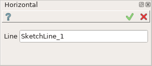

Horizontal constraint
=====================

Horizontal constraint fixes lines as parallel to the horizontal axis.

To create a Horizontal constraint in the active Sketch:

#. select in the Main Menu *Sketch - > Horizontal* item  or
#. click **Horizontal** button in Sketch toolbar:

.. centered::
   **Horizontal**  button

Property panel:

Input fields:

- **Line** is the line selected in the view.

| After the line is selected it becomes parallel to the horizontal axis in the view.
| **H** sign is added above the line.

**TUI Command**: *Sketch_1.setHorizontal(LineObject)*

**Arguments**:  1 line object

Result
""""""

Created Horizontal constraint appears in the view.

.. image:: images/Horizontal_res.png
	   :align: center

.. centered::
   Horizontal constraint created

**See Also** a sample TUI Script of :ref:`tui_create_horizontal` operation.