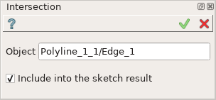
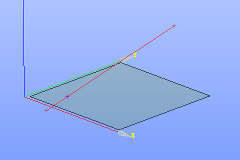

Intersection
============

| The Intersection operation creates intersection of a 3D edge and the sketch plane.
| The result of intersection is a point.

To create Intersection in the active Sketch:

#. select in the Main Menu *Sketch - > Intersection* item  or
#. click **Intersection** button in Sketch toolbar:

.. image:: images/intersection.png
   :align: center

.. centered::
   **Intersection**  button

Property panel:

.. centered::
   Intersection

Input fields:

- **Object** is the 3D edge to intersect with the sketch plane.
- **Include into the sketch result** option defines whether to include the intersection point into the sketch result.

**TUI Command**:

- *Sketch_1.addIntersectionPoint(Edge, IncludeIntoResult)*

  **Arguments**: Edge and include into the result flag

- *Sketch_1.addIntersectionPoint(EdgeName, IncludeIntoResult)*

  **Arguments**: Edge name and include into the result flag

Result
""""""

Created Intersection appears in the view.

.. centered::
   Intersection created (purple point)

**See Also** a sample TUI Script of a :ref:`tui_create_intersection` operation.
