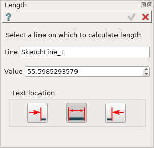
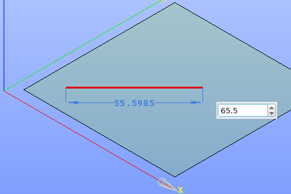

.. _sketchLength:

Length constraint
=================

Length constraint fixes the length of lines, such as standalone line or rectangle side.

To create a Length constraint in the active Sketch:

#. select in the Main Menu *Sketch - > Length* item  or
#. click **Length** button in Sketch toolbar:

.. image:: images/length.png
   :align: center

.. centered::
   **Length**  button

Property panel:

Input fields:

- **Line** is the the line object selected in the view;
- **Value** is a line length, can be modified to set the desirable value;
- **Text location** is a position of the length value label relating to extension line (in the view):
   .. image:: images/location_left.png
      :align: left
   **Left** inserts text to the left of the length extension line;

   .. image:: images/location_automatic.png
      :align: left
   **Automatic** inserts text in the middle of the length extension line if it has enough length, otherwise - to the left;

   .. image:: images/location_right.png
      :align: left
   **Right** inserts text to the right of the length extension line.

When the line is selected, the length value is displayed in the property panel and in the view.

When creating the constraint, after selection of a line for the first time:

- drag the length presentation in the view to the desired position and click once;
- set desirable length value in the input field in the view and press **Enter** or just press **Enter** to keep the current length.

.. centered::
   Length input in the view

**TUI Command**: *Sketch_1.setLength(LineObject, Value)*

**Arguments**:  line + length value

Result
""""""

Created Length appears in the view.

.. image:: images/Length_res.png
	   :align: center

.. centered::
   Length created

**See Also** a sample TUI Script of :ref:`tui_create_length` operation.
