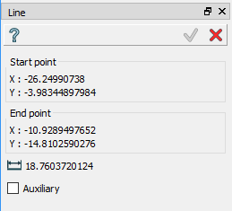
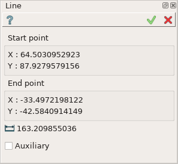
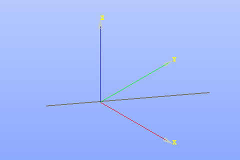

.. _sketchLine:

Line
====

Line feature creates a line segment by two points in the current Sketch.

To add a new Line to the Sketch:

#. select in the Main Menu *Sketch - > Line* item  or
#. click |line.icon| **Line** button in Sketch toolbar:

The following property panel appears:

.. centered::
   Line

Pick 2 points (start and end) in the view to create a Line. If an existing object is clicked, a constraint for the point will be created automatically.

Start and end points coordinates are displayed in the property panel.

**TUI Command**:

.. py:function:: Sketch_1.addLine(X1, Y1, X2, Y2)*

    :param real: X1 value.
    :param real: Y1 value.
    :param real: X2 value.
    :param real: Y2 value.
    :return: Result object.

Result
""""""

Created line appears in the view.

.. centered::
   Line created

**See Also** a sample TUI Script of :ref:`tui_create_line` operation.
