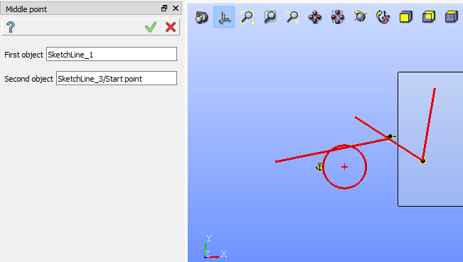

Middle point constraint
=======================

Middle point constraint forces a point to middle of a line.

To create a Middle point in the active Sketch:

#. select in the Main Menu *Sketch - > Middle point* item  or
#. click |middlepoint.icon| **Middle point** button in Sketch toolbar:

Property panel:

.. figure:: images/Middlepoint_panel.png
   :align: center

Input fields:

- **First object** is a point or a line selected in the view.
- **Second object** is a point or a line selected in the view.

Note that one of two objects should be a line and the other a point (i.e. a point, a line or an arc end point, a center of a circle or an arc).

| After the objects are selected, the point is moved to the middle of the line.
| The middle points are marked with a special sign.

**TUI Command**:

.. py:function:: Sketch_1.setMiddlePoint(Point, Line)

    :param object: A point.
    :param object: A line.
    :return: Result object.

Result
""""""

Created Middle point constraint appears in the view.

.. figure:: images/Middlepoint_res.png
   :align: center

   Created middle point constraint

**See Also** a sample TUI Script of :ref:`tui_create_middle` operation.
