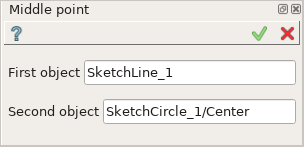

Middle point constraint
=======================

Middle point constraint makes one point to lie in the middle of a line.

To create Middle point in the active Sketch:

#. select in the Main Menu *Sketch - > Middle point* item  or
#. click **Middle point** button in Sketch toolbar:

.. image:: images/middlepoint.png
   :align: center

.. centered::
   **Middle point**  button

Property panel:

Input fields:

- **First object** is a point or a line selected in the view.
- **Second object** is a point or a line selected in the view.

Note that one of two objects should be a line and another one a point (i.e. a point, a line or an arc end point, a center of a circle or an arc).

| After the objects are selected the point becomes located in the middle of the line.
| The middle point are marked with the special sign.

**TUI Command**: *Sketch_1.setMiddlePoint(Point, Line)*

**Arguments**:  2 objects (the first is a point, the second one is a line)

Result
""""""

Created Middle point constraint appears in the view.

.. image:: images/Middlepoint_res.png
	   :align: center

.. centered::
   Middle point constraint created

**See Also** a sample TUI Script of a :ref:`tui_create_middle` operation.
