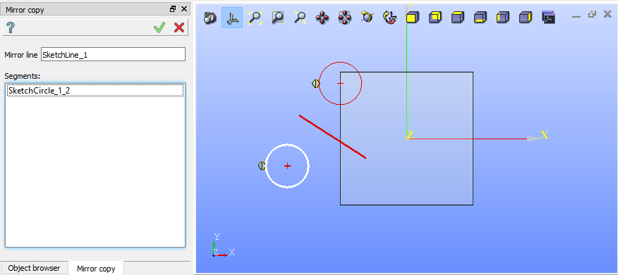
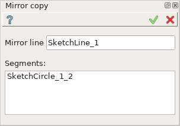
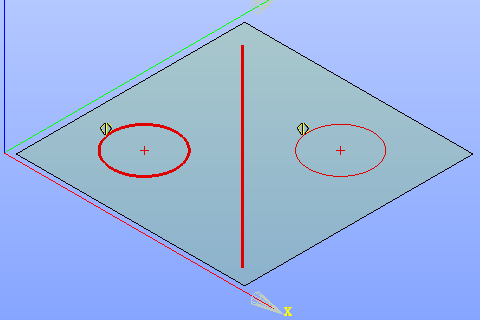

Mirror copy
===========

Mirror copy operation mirrors sketch entities across a line.

To create a Mirror copy in the active Sketch:

#. select in the Main Menu *Sketch - > Mirror copy* item  or
#. click |mirror.icon| **Mirror copy** button in Sketch toolbar:

Property panel:

   Mirror copy

Input fields:

- **Mirror line** is the mirror line selected in the view.
- **Segments** is the list of segments (lines, circles, arcs) selected in the view.

**TUI Command**:

.. py:function:: Sketch_1.addMirror(MirrorLine, Objects)

    :param object: A mirror line.
    :param listg: A list of objects.
    :return: Result object.

Result
""""""

Created Mirror copy appears in the view.

| The original and the mirror copy objects are marked with a special sign.
| Copy object is drawn with a thinner line.

   Mirror copy created

**See Also** a sample TUI Script of :ref:`tui_create_mirror` operation.
