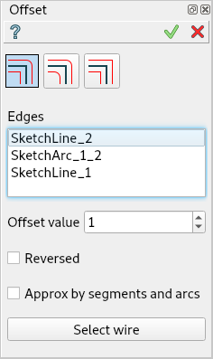

.. |offset.icon|    image:: images/offset.png

Offset
======

Offset operation offsets sketch entities on a given distance.
Offset is performed outside a closed contour or to the right
of an open one, unless the **Reversed** flag is not set.

Edges junctions are filled in accordance with selected offset mode.
The following modes are implemented:
  - **Keep distance** mode, enabled by default. It keeps the distance from initial
    contour to the resulting one, creating additional arcs where it is needed.
  - **Arcs mode**, where on connection of straight segments, tangent arcs are created.
    Only connection of straight lines is supported; with other types of curves,
    offset will work as in **Keep distance** mode. Radius of arcs equals to the offset value.
    These arcs cut off the initially connected lines, so, if in result at least one
    such line becomes invalid (removed from the result), the arc is not created
    in this connection, the line is created in this point as in the **Lines** mode.
  - **Lines** mode, where no arcs is created on the connection of the resulting lines.
    Adjacent lines are prolonged to the point of their intersection. If the offset
    arguments are not straigh lines (arcs, bspline, etc), the offset will work
    as in the **Keep distance** mode in these locations.

To create an Offset in the active Sketch:

#. select in the Main Menu *Sketch - > Offset* item  or
#. click |offset.icon| **Offset** button in Sketch toolbar:

Property panel:

.. centered::
   Offset

Input fields:

- Offset mode can be **Keep distance**, **Arcs** or **Lines**
- **Edges** is the list of segments (lines, circles, arcs) selected in the view.
- **Offset value** is the offset distance.
- **Reversed** sets the reversed offset side (inside a closed contour or to the left of an open one).

Button:

- **Select wire** button adds edges connected by coincident boundary constraint
                  and composing a wire with the already selected segments.
                  Not more than 2 edges can be connected with one coincident point.

**TUI Command**:

.. py:function:: Sketch_1.addOffset(Objects, Distance, isReversed, Mode)

    :param list: A list of objects.
    :param real: An offset distance.
    :param boolean: Reversed flag.
    :param string: Offset mode. Can be "KeepDistance", "Arcs" or "Lines".
    :return: Result object.

Result
""""""

Created Offset appears in the view.

| The original and the offset objects are marked with a special sign.
| Offset object is drawn with a thinner line.

.. image:: images/Offset_res.png
	   :align: center

.. centered::
   Offset created

**See Also** a sample TUI Script of :ref:`tui_create_offset` operation.
