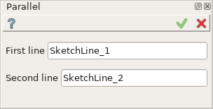
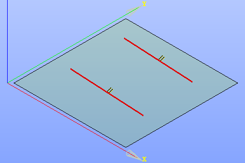

.. |parallel.icon|    image:: images/Parallel.png

Parallel constraint
===================

Parallel constraint fixes two lines as parallel to one another.

To create a Parallel constraint in the active Sketch:

#. select in the Main Menu *Sketch - > Parallel* item  or
#. click |parallel.icon| **Parallel** button in Sketch toolbar:

Property panel:

Input fields:

- **First line** is the first line selected in the view.
- **Second line** is the second line selected in the view.

After the lines are selected **||** sign will be added to each of them in the view.

**TUI Command**:

.. py:function:: Sketch_1.setParallel(Line1, Line2)

    :param object: Line 1.
    :param object: Line 2.
    :return: Result object.

Result
""""""

Created Parallel constraint appears in the view.

.. centered::
   Created parallel constraint

**See Also** a sample TUI Script of :ref:`tui_create_parallel` operation.
