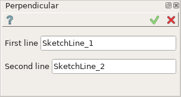
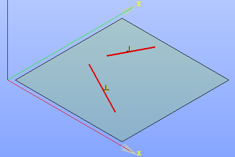

.. _sketchPerpendicular:
.. |perpendicular.icon|    image:: images/perpendicular.png

Perpendicular constraint
========================

Perpendicular constraint fixes two lines at 90 degrees to one another.

To create a Perpendicular constraint in the active Sketch:

#. select in the Main Menu *Sketch - > Perpendicular* item  or
#. click |perpendicular.icon| **Perpendicular** button in Sketch toolbar:

Property panel:

Input fields:

- **First line** is the first line selected in the view.
- **Second line** is the second line selected in the view.

After the lines are selected, a special sign will be added to each of them in the view.

**TUI Command**:

.. py:function:: Sketch_1.setPerpendicular(Line1, Line2)

    :param object: Line 1.
    :param object: Line 2.
    :return: Result object.

Result
""""""

Created Perpendicular constraint appears in the view.

.. centered::
   Created perpendicular constraint

**See Also** a sample TUI Script of :ref:`tui_create_perpendicular` operation.
