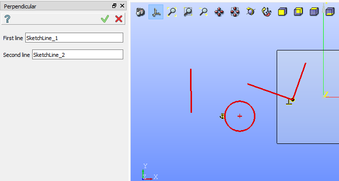

.. _sketchPerpendicular:

Perpendicular constraint
========================

Perpendicular constraint fixes two lines at 90 degrees to one another.
For a line and a circle/arc the perpendicular constraint fixes the center of circle/arc to be on a line.

To create a Perpendicular constraint in the active Sketch:

#. select in the Main Menu *Sketch - > Perpendicular* item  or
#. click |Perpendicular.icon| **Perpendicular** button in Sketch toolbar:

Property panel:

.. figure:: images/Perpendicular_panel.png
   :align: center

Input fields:

- **First object** is the first line, circle or arc selected in the view.
- **Second object** is the second line, circle or arc selected in the view.

After the objects are selected, a special sign will be added to each of them in the view.

If one of selected objects is circular, then another has to be a straight line.

**TUI Command**:

.. py:function:: Sketch_1.setPerpendicular(Line1, Line2)

    :param object: Line 1.
    :param object: Line 2.
    :return: Result object.

Result
""""""

Created Perpendicular constraint appears in the view.

.. figure:: images/Perpendicular_res.png
   :align: center

   Created perpendicular constraint

**See Also** a sample TUI Script of :ref:`tui_create_perpendicular` operation.
