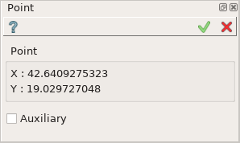
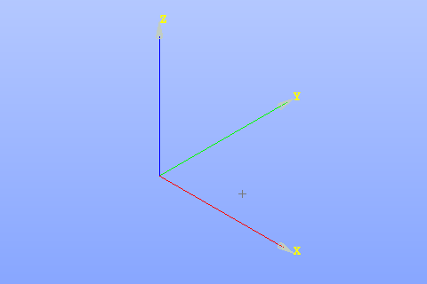

.. |point.icon|    image:: images/Point.png

Point
=====

Point feature creates a point in the current Sketch.

To add a new Point to the Sketch:

#. select in the Main Menu *Sketch - > Point* item  or
#. click |point.icon| **Point** button in Sketch toolbar:

The following property panel appears:

.. centered::
   Point

Clicking in the view creates a point preview. If an existing object is clicked, a constraint for
the point will be created automatically.

The point coordinates are displayed in the property panel.

**TUI Command**:

.. py:function:: Sketch_1.addPoint(X, Y)

    :param real: X value.
    :param real: Y value.
    :return: Result object.

Result
""""""

Created point appears in the view.

.. centered::
   Point created

**See Also** a sample TUI Script of :ref:`tui_create_point` operation.
