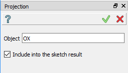
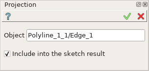
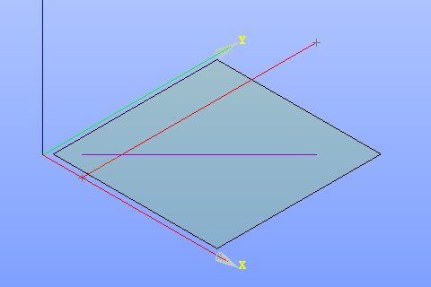

Projection
==========

| The Projection operation creates a projection of 3D edge or vertex onto the sketch plane.
| The result of projection is a line.

To create a Projection in the active Sketch:

#. select in the Main Menu *Sketch - > Projection* item  or
#. click |projection.icon| **Projection** button in Sketch toolbar:

Property panel:

   Projection

Input fields:

- **Object** is the 3D object (edge or vertex) to project onto the sketch plane.
- **Include into the sketch result** option defines whether to include the projection line into the sketch result.

**TUI Commands**:

.. py:function:: Sketch_1.addProjection(EdgeOrVertex, IncludeIntoResult)

    :param object: Edge or vertex.
    :param boolean: Include into the result flag.
    :return: Result object.

.. py:function:: Sketch_1.addProjection(EdgeOrVertexName, IncludeIntoResult)

    :param object: Edge or vertex name.
    :param boolean: Include into the result flag.
    :return: Result object.

Result
""""""

Created Projection appears in the view.

   Created projection (purple line)

**See Also** a sample TUI Script of :ref:`tui_create_projection` operation.
