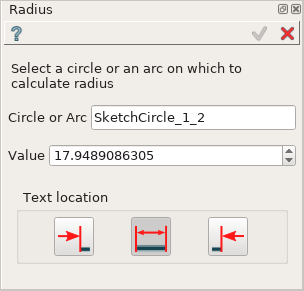
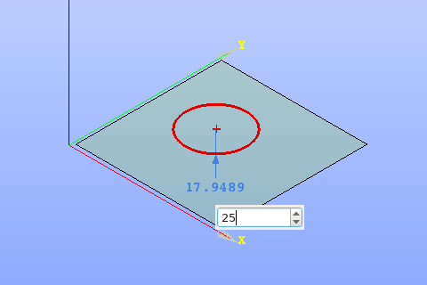
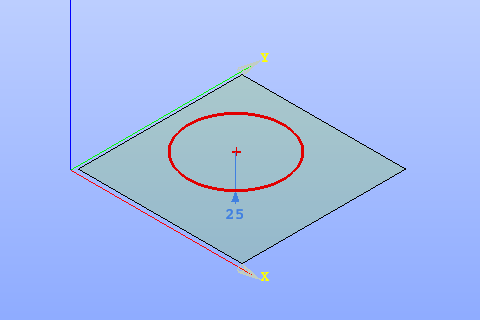

.. |radius_constr.icon|    image:: images/radius_constr.png

Radius constraint
=================

Radius constraint fixes the radius of circle or arc.

To create a Radius constraint in the active Sketch:

#. select in the Main Menu *Sketch - > Radius* item  or
#. click |radius_constr.icon| **Radius** button in Sketch toolbar:

Property panel:

.. |loc_left| image:: images/location_left.png
.. |loc_auto| image:: images/location_automatic.png
.. |loc_right| image:: images/location_right.png

Input fields:

- **Circle or Arc** is the circle or arc selected in the view; 
- **Value** is a radius of the selected object, could be modified to set the desirable value
- **Text location** is a position of the radius value label relating to extension line (in the view)
   | |loc_left| **Left** inserts text at the left of the radius extension line.
   | |loc_auto| **Automatic** inserts text at the middle of the radius extension line if it has enough length, otherwise - to the left.
   | |loc_right| **Right** inserts text to the right of the radius extension line.

When circle or arc is selected, the radius value is displayed in the property panel and in the view.

When creating the constraint, after selection of the circle or arc at the first time :

- drag the radius presentation in the view to the desired position and click once;
- set desirable radius value in the input field in the view and press **Enter** or just press **Enter** to keep the current radius.

.. centered::
   Radius input in the view

**TUI Command**:

.. py:function:: Sketch_1.setRadius(CircleOrArc, Value)

    :param object: Circle or arc.
    :param real: Radius.
    :return: Result object.

Result
""""""

Created Radius appears in the view.

.. centered::
   Radius created

**See Also** a sample TUI Script of :ref:`tui_create_radius` operation.
