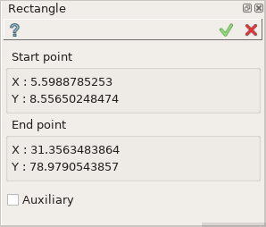
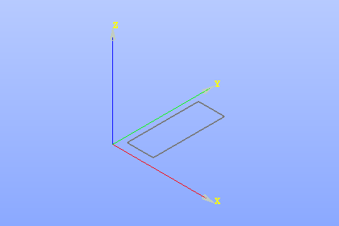

  .. _create_sketch_rectangle:

Rectangle
=========

Rectangle feature creates a rectangle by two opposite points in the current Sketch.

The result is represented in form of four Lines which compose a rectangle.
Two lines have Vertical constraint and two others have Horizontal constraint.

To add a new Rectangle to the Sketch:

#. select in the Main Menu *Sketch - > Rectangle* item  or
#. click **Rectangle** button in Sketch toolbar:

.. image:: images/rectangle.png
   :align: center

.. centered::
   **Rectangle**  button

The following property panel appears:

.. centered::
   Rectangle

Click in the view once to set the first corner, then move the mouse and click a second time to set the opposite corner.
If an existing object is clicked, a constraint for the point will be created automatically.

Start and end points coordinates are displayed in the property panel.

**TUI Command**:  *Sketch_1.addRectangle(X1, Y1, X2, Y2)*

**Arguments**:    4 values (coordinates of the start and end points).

Result
""""""

Created rectangle appears in the view.

.. centered::
   Rectangle created

**See Also** a sample TUI Script of :ref:`tui_create_rectangle` operation.