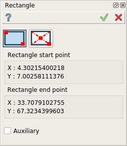
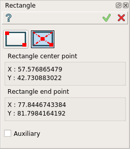
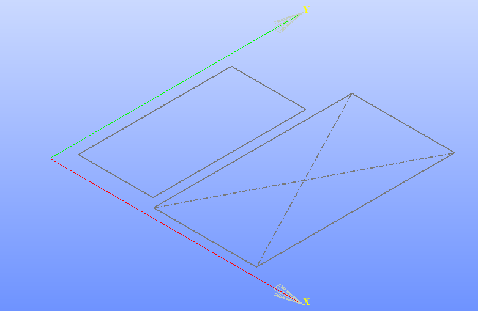

.. _create_sketch_rectangle:

Rectangle
=========

.. |rectangle.icon|    image:: images/Rectangle.png

Rectangle feature creates a rectangle by two opposite points in the current Sketch.

The result is represented in form of four Lines which compose a rectangle.
Two lines have Vertical constraint and two others have Horizontal constraint.

To add a new Rectangle to the Sketch:

#. select in the Main Menu *Sketch - > Rectangle* item  or
#. click |rectangle.icon| **Rectangle** button in Sketch toolbar:

There are 2 algorithms for creation of a Rectangle:

.. figure:: images/rectangle_start_end.png
   :align: left
   :height: 24px

**By start and end points** creates a rectangle with the given two corners points.

.. figure:: images/rectangle_center_end.png
   :align: left
   :height: 24px

**By center and end point** creates a rectangle with center and end point as corner.

-------------------------------------------------------------------------------------------

By start and end points
""""""""""""""""""""""""""

   Rectangle

Click in the view once to set the first corner, then move the mouse and click a second time to set the opposite corner.
If an existing object is clicked, a constraint for the point will be created automatically.

Start and end points coordinates are displayed in the property panel.

**TUI Command**:

.. py:function:: Sketch_1.addRectangle(X1, Y1, X2, Y2)

    :param real: X1 corner X value.
    :param real: Y1 corner Y value.
    :param real: X2 opposite corner X value.
    :param real: Y2 opposite corner Y value.
    :return: Result object.

By center and end point
""""""""""""""""""""""""""

   Rectangle

Click in the view once to set the center, then move the mouse and click a second time to set the corner.
If an existing object is clicked, a constraint for the point will be created automatically.

Center and end points coordinates are displayed in the property panel.

**TUI Command**:

.. py:function:: Sketch_1.addRectangleCentered(X1, Y1, X2, Y2)

    :param real: X1 center X value.
    :param real: Y1 center Y value.
    :param real: X2 corner X value.
    :param real: Y2 corner Y value.
    :return: Result object.

Result
""""""

Created rectangle appears in the view.

   Rectangles created

**See Also** a sample TUI Script of :ref:`tui_create_rectangle` operation.
