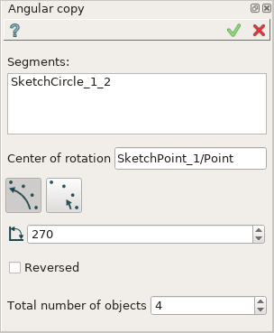
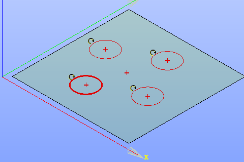

.. _sketchAngularCopy:

Angular copy
============

Angular copy operation creates one or multiple copies of the sketch entities by rotation relative to a specified center point.

To create an Angular copy in the active Sketch:

#. select in the Main Menu *Sketch - > Angular copy* item  or
#. click **Angular copy** button in Sketch toolbar:

.. image:: images/rotate.png
   :align: center

.. centered::
   **Angular copy**  button

Property panel:

.. centered::
   Angular copy

Input fields:

- **Segments** is the list of segments (lines, circles, arcs) selected in the view;
- **Center of rotation** is the center point selected in the view;
- **Full angle/Single angle** option:

  .. image:: images/angle_up_full_32x32.png
     :align: left
  **Full angle**: angle step of rotation is equal to the defined angle divided by the number of copies (total number minus one).

  .. image:: images/angle_up_full_32x32.png
     :align: left
  **Single angle**: angle step of rotation is equal to the defined angle.

- **Angle** is the angle of rotation.
- **Reversed** defines rotation direction. If checked - in a clockwise direction, otherwise - in a counterclockwise direction.
- **Total number of objects** is the total number of objects including the original one.

**TUI Command**: *Sketch_1.addRotation(Objects, CenterPoint, Angle, NumberOfObjects, FullValue, Reversed)*

**Arguments**:   list of objects + center point + angle + number of objects + full value flag + reversed flag

Result
""""""

Created Angular copy appears in the view.

| The original and an angular copy objects are marked with a special sign.
| Copy objects are drawn with a thinner line.

.. centered::
   Created angular copy

**See Also** a sample TUI Script of :ref:`tui_create_rotation` operation.
