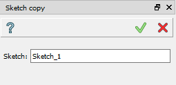

.. _create_sketch_copy:
.. |SketchCopy.icon|    image:: images/SketchCopy.png

Sketch Copy
===========

This macro will just copy the selected sketch feature into a new sketch feature and disappear.
So, the new sketch feature will be placed into the current history location with all sub-elements 
of the sketch copied.

To start a Sketch Copy operation:

#. select in the Main Menu *Macros - > Sketch Copy* item  or
#. click |SketchCopy.icon| **Sketch Copy** button in Macros toolbar:

The following property panel appears:

   Sketch copy panel

Select a sketch feature to copy. On Apply button press the copied sketch will be created in the Object Browser tree.

**TUI Command**:

.. py:function:: model.copySketch(Doc, Sketch)

    :param document: A document where to copy the sketch.
    :param object: A sketch to be copied.
    :return: Copied sketch.

**See Also** a sample TUI Script of :ref:`tui_copy_sketch` operation.
