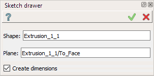
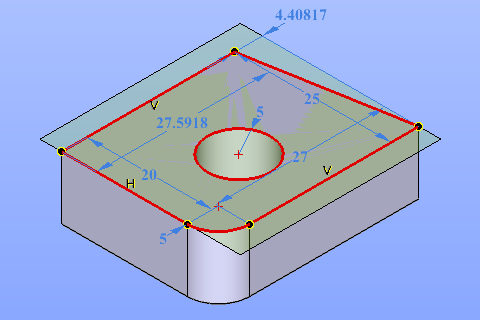

  .. _create_sketch_drawer:

Sketch Drawer
=========

Sketch Drawer featrure is a macro-feature, i.e. it is removed after its execution.
It allows simplify creation of sketches basing on existing models without referencing to
these models.

For an example, to create a sketch on exising STEP file model planar face
and then remove the original model, to keep only the sketch with copy of contour. So, to be
able to remove the initial model, there are no references created by this feature.

To add a new Sketch Drawing:

#. select in the Main Menu *Macros - > Sketch drawer* item  or
#. click **Sketch drawer** button in Macros toolbar:

.. centered::
   **Sketch drawer**  button

The following property panel appears:

.. centered::
   Sketch drawer

Click in the view once to set the whole original model, then click a second time to set the
plane or planar face - a base of sketch. This can be plane on the original model.
On Apply button press the new sketch will be created in the Object Browser tree.

Result
""""""

A resulting sketch will contain linear and circular edges as well as circular arcs corresponding to the
original model edges that lay in the sketch plane. Other types of edges are not supported.

Radius, length, vertical, horizontal and points-coincidence constraints will be created
automatically where it is possible. The resulting sketch may be overconstrained or not fully
constrained. So, it is just a helper for the sketch creation, not universal tool. After this
sketch creation normally user must edit this sketch to input reasonable constraints and
parametrization, or remove not needed constraints or sketch lements.

.. centered::
   Drawn sketch
