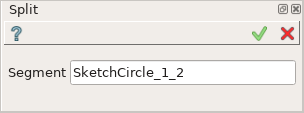
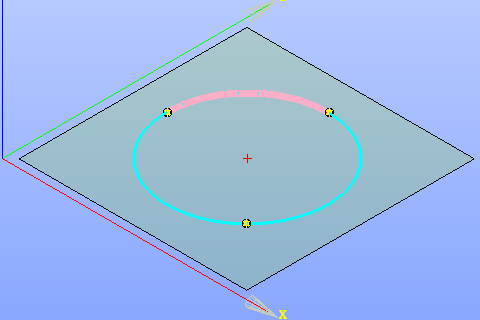
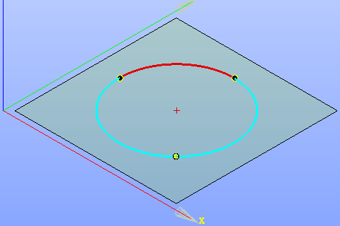

Split
=====

| The Split operation splits sketch curve into multiple segments.
| The curve should have points lying on it.
| Open curves (line or arc) require one or more points to split with; closed curves (circle) require two or more points.

To create a Split in the active Sketch:

#. select in the Main Menu *Sketch - > Split* item  or
#. click **Split** button in Sketch toolbar:

.. image:: images/split.png
   :align: center

.. centered::
   **Split**  button

Property panel:

.. centered::
   Split

Input fields:

- **Segment** is used to select a segment to be split off in the view.

The selected segment is highlighted in the view:

.. centered::
   The segment to split off

**TUI Command**: *Sketch_1.addSplit(Feature, PositionPoint)*

**Arguments**:   feature (line, arc or circle) and position point (a point on the segment to split off or closest to it)

Result
""""""

Created Split appears in the view.

.. centered::
   Created split 

**See Also** a sample TUI Script of :ref:`tui_create_split` operation.