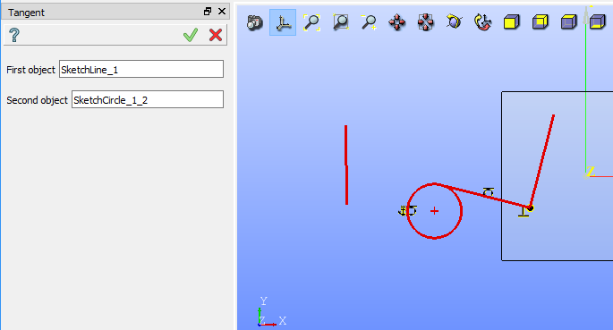
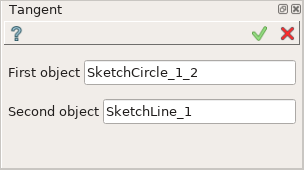
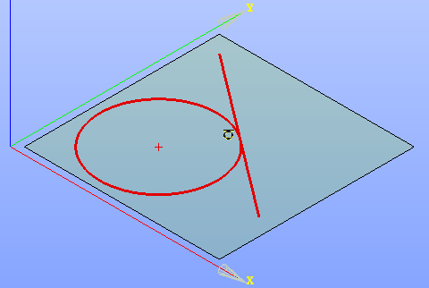

Tangent constraint
==================

Tangent constraint fixes a circle (or an arc) and a line so that a line is tangent to a circle (or an arc).

To create a Tangent in the active Sketch:

#. select in the Main Menu *Sketch - > Tangent* item  or
#. click |tangent.icon| **Tangent** button in Sketch toolbar:

Property panel:

Input fields:

- **First object** is a line, a circle or an arc selected in the view.
- **Second object** is a line, a circle or an arc selected in the view.

Note that one of two objects should be a line.

After the objects are selected, a special sign will be added close to the tangency point in the view.

**TUI Command**:

.. py:function:: Sketch_1.setTangent(Line, CircleOrArc)

    :param object: A line.
    :param object: A circle or an arc.
    :return: Result object.

Result
""""""

Created Tangent constraint appears in the view.

.. centered::
   Created tangent constraint

**See Also** a sample TUI Script of :ref:`tui_create_tangent` operation.
