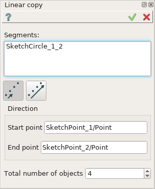
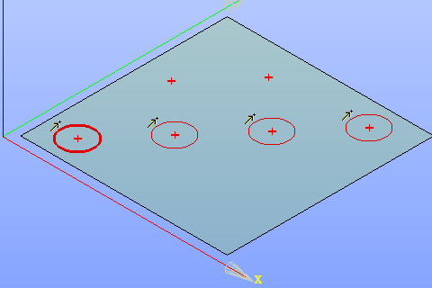

Linear copy
===========

Linear copy operation creates one or multiple copies of the sketch entities along a vector defined by two points.

To create a Linear copy in the active Sketch:

#. select in the Main Menu *Sketch - > Linear copy* item  or
#. click |translate.icon| **Linear copy** button in Sketch toolbar:

Property panel:

.. centered::
   Linear copy

Input fields:

- **Segments** is the list of segments (lines, circles, arcs) selected in the view.
- **Single value/Full value** option:

  .. image:: images/translate_32x32.png
     :align: left
  **Single value**: step of translation is equal to the distance between the start and the end point.

  .. image:: images/translate_full_32x32.png
     :align: left
  **Full value**: distance from the originals to the farthest copies is equal to the distance between the start and the end point.
- **Start point** is the initial point of translation vector.
- **End point** is the terminal point of translation vector.
- **Total number of objects** is the total number of objects including the original one.

**TUI Command**:

.. py:function:: Sketch_1.addTranslation(Objects, Point1, Point2, NumberOfObjects, FullValue)

    :param list: A list of objects.
    :param object: Start point.
    :param object: End point.
    :param integer: Number of objects.
    :param boolean: Full value flag.
    :return: Result object.

Result
""""""

Created Linear copy appears in the view.

| The original and a linear copy objects are marked with a special sign.
| Copy objects are drawn with a thinner line.

.. centered::
   Linear copy created

**See Also** a sample TUI Script of :ref:`tui_create_translation` operation.
