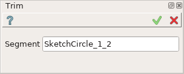
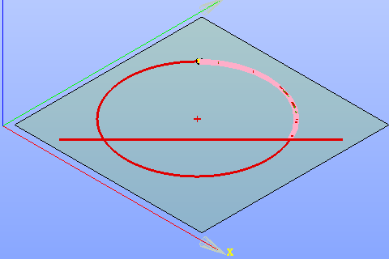
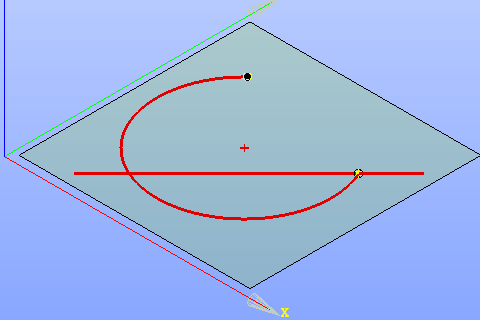

Trim
====

| The Trim operation trims away the specified segment of the curve.
| The curve should have points lying on it or intersections with other curves.
| Open curves (line or arc) require one or more points; closed curves (circle) require two or more points.

To create a Trim in the active Sketch:

#. select in the Main Menu *Sketch - > Trim* item  or
#. click **Trim** button in Sketch toolbar:

.. image:: images/trim.png
   :align: center

.. centered::
   **Trim**  button

Property panel:

.. centered::
   Trim

Input fields:

- **Segment** is used to select a segment to remove in the view.

The selected segment is highlighted in the view:

.. centered::
   The segment to remove

**TUI Command**: *Sketch_1.addTrim(Feature, PositionPoint)*

**Arguments**:   feature (line, arc or circle) and position point (a point on or closest to the segment to remove)

Result
""""""

Created Trim appears in the view.

.. centered::
   Created trim

**See Also** a sample TUI Script of :ref:`tui_create_trim` operation.
