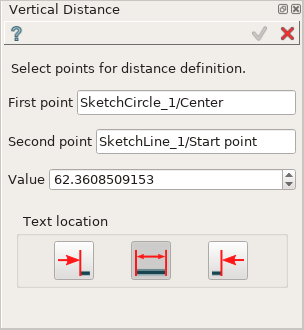
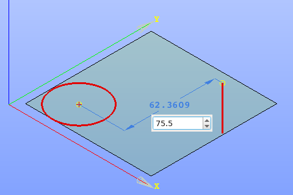
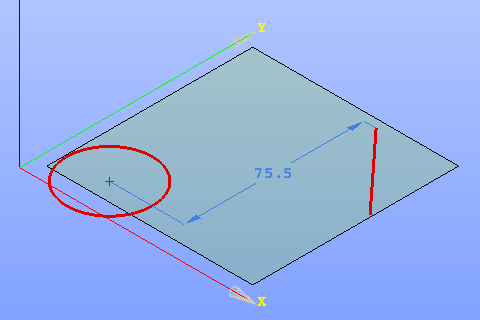

.. |distance_v.icon|    image:: images/distance_v.png

Vertical distance constraint
============================

Vertical Distance constraint fixes the distance between two points along the vertical axis.

The constraint can be defined between two points such as point object, line or arc end point, center of circle or arc.

To create a Vertical Distance constraint in the active Sketch:

#. select in the Main Menu *Sketch - > Vertical Distance* item  or
#. click |distance_v.icon| **Vertical Distance** button in Sketch toolbar:

Property panel:

.. |location_left| image:: images/location_left.png
.. |location_auto| image:: images/location_automatic.png

Input fields:

- **First point** is the first point selected in the view;
- **Second point** is the second point selected in the view:
- **Value** is a distance between the objects, can be modified to set the desirable value;
- **Text location** is a position of the distance value label relating to extension line (in the view):
   | |location_left| **Left** inserts text to the left of the distance extension line:
   | |location_auto| **Automatic** inserts text in the middle of the distance extension line if it has enough length, otherwise - to the left
   | |location_right| **Right** inserts text to the right of the distance extension line.

When both objects are selected, the vertical distance value is displayed in the property panel and in the view.

When creating the constraint, after selection of two objects for the first time:

- drag the Vertical distance presentation in the view to the desired position and click once;
- set desirable vertical distance value in the input field in the view and press **Enter** or just press **Enter** to keep the current distance.

   Vertical Distance input in the view

**TUI Command**:

.. py:function:: Sketch_1.setVerticalDistance(FirstObject, SecondObject, Value)

    :param object: First object.
    :param object: Second object.
    :param real: Value.
    :return: Result object.

Result
""""""

Created Vertical Distance appears in the view.

   Vertical Distance created

**See Also** a sample TUI Script of :ref:`tui_create_vdistance` operation.
