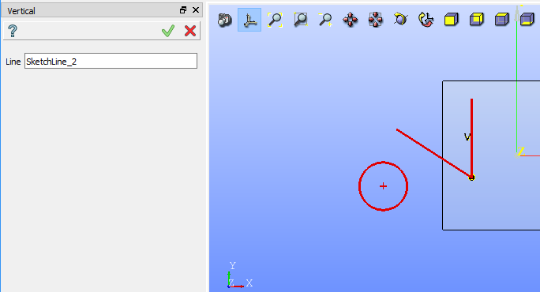
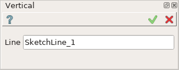
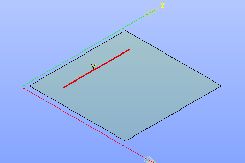

Vertical constraint
===================

Vertical constraint fixes lines as parallel to the vertical axis.

To create a Vertical constraint in the active Sketch:

#. select in the Main Menu *Sketch - > Vertical* item  or
#. click |vertical.icon| **Vertical** button in Sketch toolbar:

Property panel:

Input fields:

- **Line** is the line selected in the view.

| After the line is selected it becomes parallel to the vertical axis in the view.
| **V** sign is added above the line.

**TUI Command**:

.. py:function:: Sketch_1.setVertical(LineObject)

    :param object: A line.
    :return: Result object.

Result
""""""

Created Vertical constraint appears in the view.

   Vertical constraint created

**See Also** a sample TUI Script of :ref:`tui_create_vertical` operation.
